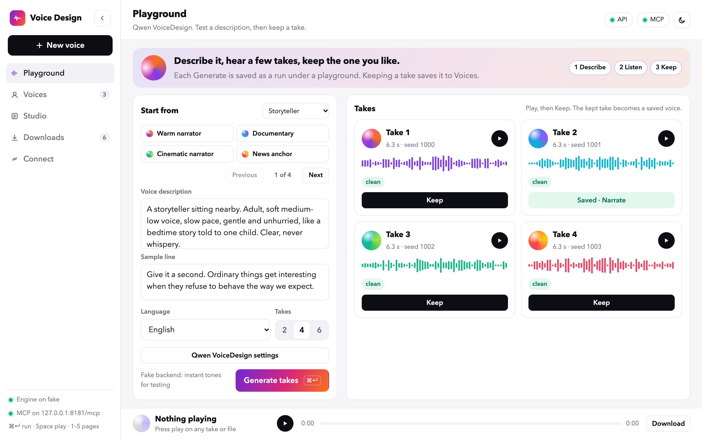
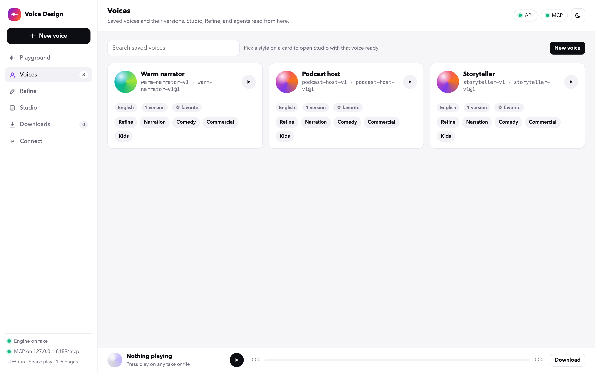
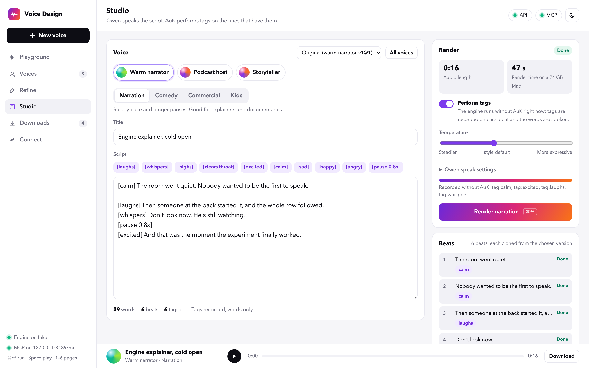
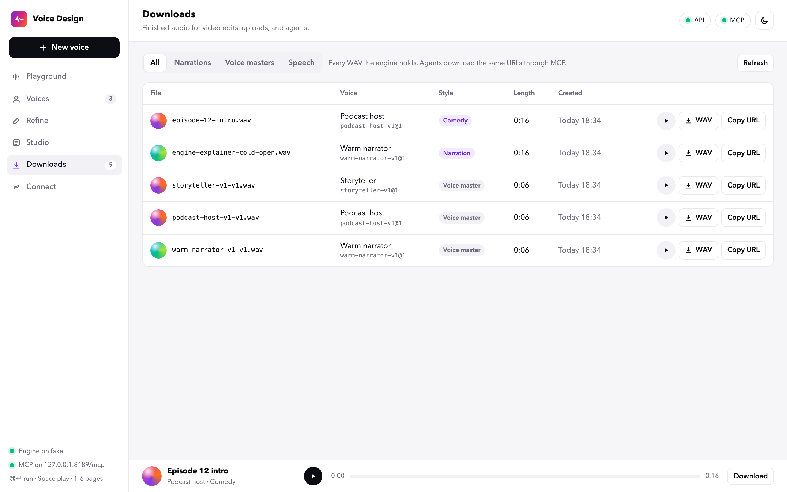
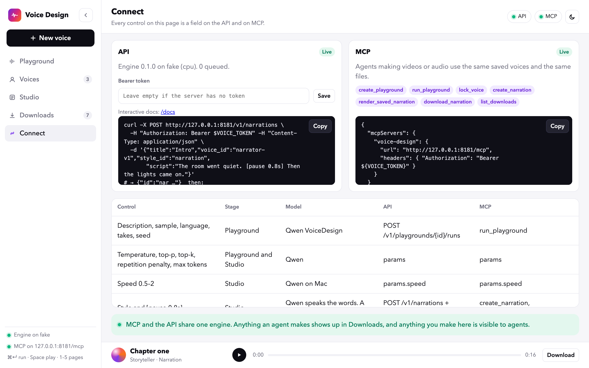
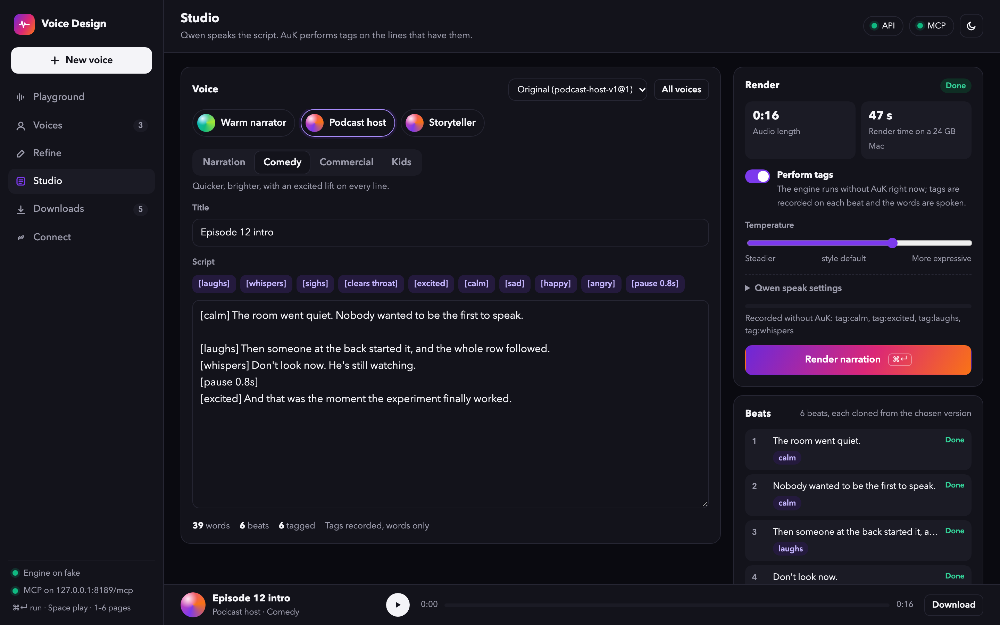

<p align="center">
  
</p>

<h1 align="center">Voice Design</h1>

<p align="center">
  <strong>Design a speaking voice from a description, keep it, and narrate with it.</strong><br>
  Qwen3-TTS designs and speaks. <code>[pause 0.8s]</code> sets a gap; the words are what get spoken.<br>
  One dashboard, one HTTP API, and one MCP endpoint share the same library, on this machine or on a GPU server.
</p>

<p align="center">
  <a href="LICENSE"></a>
  
</p>

<p align="center">
  <a href="#quick-start">Quick start</a> ·
  <a href="#snapshots">Snapshots</a> ·
  <a href="#set-up-for-your-machine">Environments</a> ·
  <a href="docs/backend.md">API</a> ·
  <a href="docs/mcp.md">MCP</a> ·
  <a href="CHANGELOG.md">Changelog</a>
</p>

## Snapshots

The dashboard as it runs in the browser, captured from the fake backend so
the audio is synthetic and the flow is real.

<p align="center">
  
</p>

<p align="center">
  
</p>

<p align="center">
  
</p>

<p align="center">
  
</p>

<p align="center">
  
</p>

Dark mode follows the system and can be toggled from the top bar:

<p align="center">
  
</p>

## What you can do with it

| Stage | What happens | Model |
| --- | --- | --- |
| **Playground** | Describe a speaker, hear 2–8 takes, keep one. Every Generate is a saved run under a playground, so you can come back to it. | Qwen3-TTS VoiceDesign |
| **Voices** | Kept takes become voices. Version 1 is the kept take. Favorite, archive, rename, copy. | |
| **Studio** | Write a script. `[pause 0.8s]` sets a gap. Pick a voice and a style. Render up to about ten minutes as one stitched WAV. | Qwen3-TTS Base |
| **Downloads** | Every WAV: narrations, voice masters, speech. Play, download, copy URL. | |
| **Connect** | API and MCP status, token entry, and a table of which control maps to which field. | |

Everything the dashboard does is a call on the API, and every API call has an
MCP tool. An agent and a person work on the same playgrounds, voices, and
narrations.

## Quick start

Requirements: Python 3.12 with [uv](https://docs.astral.sh/uv/), and
[Bun](https://bun.sh) 1.1 or newer.

```bash
bun setup.ts        # picks mlx / cuda / cpu for this machine, installs, downloads the Qwen weights
bun install --cwd packages/studio
bun start.ts        # engine on 127.0.0.1:8100, dashboard + API + MCP on http://127.0.0.1:8180
```

Open <http://127.0.0.1:8180>. Pick a template, press **Generate takes**, play
them, press **Keep** on one. The **Narrate now** toast opens the Studio with
that voice.

`bun setup.ts --backend=cpu` (or `mlx`, `cuda`) overrides the detection.
`bun start.ts --dev` reloads the dashboard when its files change; the engine
keeps running.

## Set up for your machine

| Machine | Qwen backend | Setup |
| --- | --- | --- |
| Mac, Apple Silicon | `mlx` | `bun setup.ts` |
| Linux / Windows, NVIDIA | `cuda` | `bun setup.ts` |
| No GPU | `cpu` | `bun setup.ts --backend=cpu` (slow: about 30 s for a 4 s line) |
| Tests, no models | `fake` | `uv sync --project packages/engine --extra dev` |

`uv run --project packages/engine voice-engine doctor` prints the machine and
which Qwen backend the engine will use.

The CPU path runs the same 1.7B models in float32 and needs about 14 GB of
free RAM with both models loaded. Set `preload = false` to load them one at
a time.

### Manual install

`bun setup.ts` runs these two commands:

```bash
# Apple Silicon --extra mac · NVIDIA --extra cuda · no GPU --extra cpu
uv sync --python 3.12 --project packages/engine --extra mac
uv run --project packages/engine voice-engine setup --backend mlx   # downloads the two Qwen repos
```

## Run it on a GPU server

Edit `voice-generator.toml`:

```toml
[server]
host = "0.0.0.0"
port = 8180
token = "a-long-random-string"

[engine]
backend = "cuda"    # or "auto"
```

Start it on the server with `bun start.ts`, open `http://<server>:8180` from
another machine, and paste the token on **Connect**. The engine itself
listens only on `127.0.0.1` of that server. The studio checks the token
before forwarding anything to `/v1` or `/mcp`.

## Configuration

`voice-generator.toml` at the repository root is the only file to edit.

| Key | Default | Meaning |
| --- | --- | --- |
| `server.host` | `127.0.0.1` | `0.0.0.0` publishes the dashboard, API, and MCP |
| `server.port` | `8180` | Address the browser opens |
| `server.token` | empty | Required when `host` is not loopback |
| `engine.port` | `8100` | Loopback port of the engine |
| `engine.backend` | `auto` | `auto`, `mlx`, `cuda`, `cpu`, or `fake` |
| `engine.data_dir` | `data` | `studio.db` and MCP downloads |
| `engine.preload` | `true` | Load both Qwen models at startup |

## HTTP API

With the tool running, Swagger UI and the spec are on the same origin:
<http://127.0.0.1:8180/docs> and <http://127.0.0.1:8180/openapi.json>.
`common/openapi.json` is the same document checked in, so a client can be
generated without starting the server.

| Section | Create | Read | Act | Download |
| --- | --- | --- | --- | --- |
| Playgrounds | `POST /v1/playgrounds` | `GET /v1/playgrounds/{id}` | `PATCH`, `POST …/copy`, `POST …/runs` | takes via `GET /v1/jobs/{job}/files/candidate-01.wav` |
| Voices | `POST /v1/voices` (keep) | `GET /v1/voices` | `PATCH`, `POST …/copy`, `DELETE` | `GET /v1/voices/{id}/files/master.wav` |
| Versions | | `GET /v1/voices/{id}/versions` | `PATCH …/{version}` | `GET …/{version}/master.wav` |
| Styles | `POST /v1/styles` | `GET /v1/styles` | `PATCH`, `DELETE` | |
| Narrations | `POST /v1/narrations` | `GET /v1/narrations/{id}` | `PATCH`, `POST …/render`, `POST …/copy`, `DELETE` | `GET /v1/narrations/{id}/audio.wav` |
| Downloads | | `GET /v1/downloads` | | each row has `url` |
| Jobs | `POST /v1/jobs`, `/v1/designs`, `/v1/speech`, `/v1/renders` | `GET /v1/jobs/{id}` | `DELETE` (cancel) | `GET /v1/jobs/{id}/files/{name}` |

Long work is a job. The response is immediate; poll `GET /v1/jobs/{id}` and
read `progress` (`phase`, `detail`, `completed`, `total`). Downloading a file
before it exists returns `409` with the progress text. Details, job specs,
and the audio checks are in [docs/backend.md](docs/backend.md). The database
layout is in [docs/database.md](docs/database.md).

```bash
curl -s http://127.0.0.1:8180/health
curl -s -X POST http://127.0.0.1:8180/v1/narrations -H 'content-type: application/json' \
  -d '{"title":"Intro","voice_id":"warm-narrator-v1","style_id":"narration","script":"The room went quiet. [pause 0.8s] Then the lights came on."}'
curl -s -X POST http://127.0.0.1:8180/v1/narrations/NAR_ID/render        # returns the job
curl -s -o intro.wav http://127.0.0.1:8180/v1/narrations/NAR_ID/audio.wav  # once the job succeeded
```

## MCP for agents

voice-design is the MCP endpoint on the studio, `http://<server>:8180/mcp`.
Tools mirror the API: `create_playground`, `run_playground`, `lock_voice`,
`create_narration`, `render_saved_narration`,
`download_narration`, `list_downloads`, and the rest. Long jobs return a job
id at once; `get_job` reports progress and a `next` sentence that says
whether to wait, download, or resubmit. Downloads write WAVs under
`data/out` and return paths, never bytes. The tool list and the client
config are in [docs/mcp.md](docs/mcp.md).

## Layout

```text
voice-generator.toml     configuration
setup.ts                 one-command install and weight download
start.ts                 starts the engine, then the studio
common/openapi.json      API contract
packages/engine/         Python. Models, queue, library, SQLite. Loopback only.
packages/studio/         TypeScript. The dashboard and the proxy to the engine.
packages/mcp/            voice-design tools, served at /mcp on the studio.
design/dashboard.html    the standalone UI mock the dashboard was built from
docs/                    backend, database, frontend, MCP, templates
data/                    studio.db and generated audio (not part of the source)
```

The studio does not import the engine. It forwards `/health`, `/v1/*`,
`/docs`, and `/openapi.json`. The UI and the models restart independently,
and the model port stays off the network.

## Development

```bash
uv run --project packages/engine --extra dev pytest packages/engine/tests   # fake backend
bun test packages/mcp/tests                                                 # tools, HTTP transport
bun run --cwd packages/studio typecheck
uv run --project packages/engine python packages/engine/scripts/export_openapi.py
```

See [CONTRIBUTING.md](CONTRIBUTING.md). Changes between versions are in
[CHANGELOG.md](CHANGELOG.md).

## Models

Design uses Qwen3-TTS 1.7B VoiceDesign; keeping and speaking use Qwen3-TTS
1.7B Base. On Apple Silicon the engine loads the MLX builds
(`mlx-community`, 4-bit VoiceDesign and bf16 Base); on NVIDIA and CPU it
loads the upstream Qwen weights through `qwen-tts`.

Qwen settings on the dashboard, API, and MCP: temperature, top-p, top-k,
repetition penalty, max tokens, speed (MLX). Each job records which settings
were applied and which were deferred.

## License

[MIT](LICENSE) for the code in this repository. Qwen3-TTS weights are
Apache-2.0 and download separately. Library notices are in [NOTICE](NOTICE).
