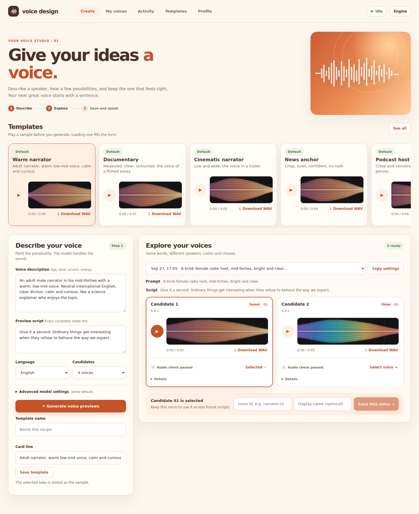
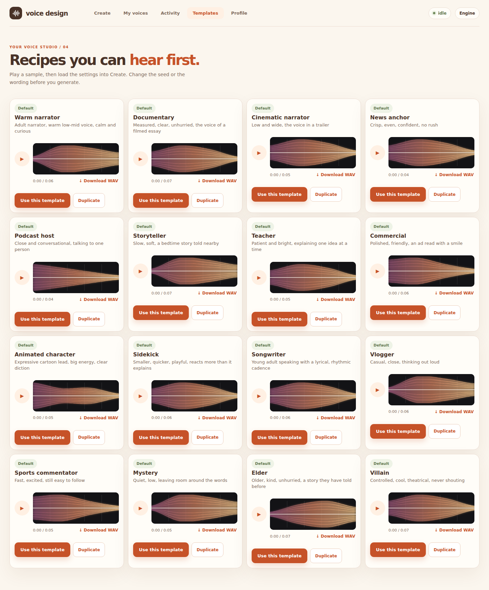
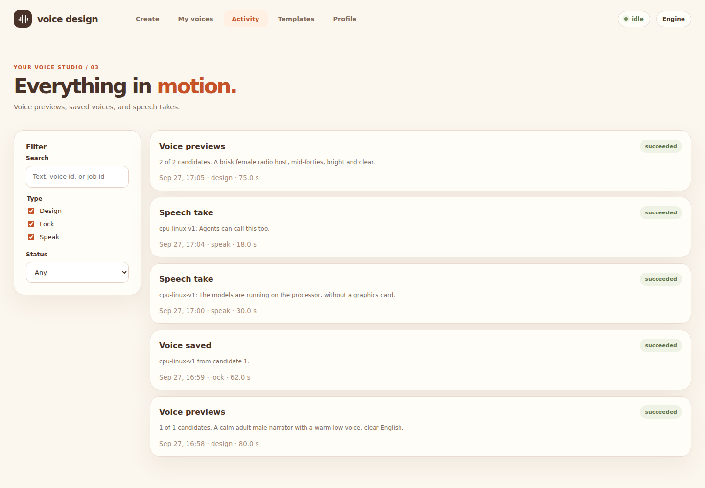

<p align="center">
  
</p>

<h1 align="center">Voice Design</h1>

<p align="center">
  <strong>Design a speaking voice from a written description, then keep it.</strong><br>
  Hear several candidates of that speaker, lock one, and generate new lines in that voice.<br>
  One command starts the engine and the studio, on this machine or on a GPU server.
</p>

<p align="center">
  <a href="LICENSE"></a>
  
</p>

<p align="center">
  <a href="#quick-start">Quick start</a> ·
  <a href="#snapshots">Snapshots</a> ·
  <a href="docs/backend.md">API</a> ·
  <a href="docs/mcp.md">MCP</a> ·
  <a href="LICENSE">License</a>
</p>

## Snapshots

The studio, as it runs in the browser. Create a voice, keep it, then speak with it.

<p align="center">
  
</p>

<p align="center">
  
</p>

<p align="center">
  
</p>

<p align="center">
  
</p>

## What you can do with it

- Describe a voice (age, pitch, pace, accent, role) and hear several
  candidates of that speaker.
- Lock one candidate under a permanent id, such as `narrator-male-v1`.
- Generate new lines, including multi-line scripts, in that voice, and play
  or download the WAV in the browser.
- Run the same flow on a remote NVIDIA machine and open the UI from a laptop.
- Skip the UI and drive the HTTP API with curl or the Swagger page.

## Requirements

| Machine | Backend | Extra |
| --- | --- | --- |
| Mac, Apple Silicon | MLX (Metal) | `--extra mac` |
| Linux or Windows with NVIDIA | CUDA, qwen-tts | `--extra cuda` |
| Linux or Mac without a GPU | CPU, qwen-tts | `--extra cpu` |
| Tests, no models | fake tones | `--extra dev` only |

- Python 3.12 and [uv](https://docs.astral.sh/uv/)
- [Bun](https://bun.sh) 1.1 or newer
- A few gigabytes of disk for the model weights, downloaded on first use

`backend = "auto"` picks MLX on Apple Silicon, CUDA when PyTorch sees an
NVIDIA GPU, and otherwise the CPU when `--extra cpu` is installed. The CPU
path runs the same 1.7B models in float32. It is several times slower than a
GPU (about 30 seconds for a 4 second line on an 8-core laptop) and needs
around 14 GB of free RAM when both models are loaded. Set `preload = false`
to load them one at a time.

## Quick start

```bash
# Apple Silicon. On NVIDIA use --extra cuda, on a machine without a GPU --extra cpu.
uv sync --python 3.12 --project packages/engine --extra mac --extra dev
bun install --cwd packages/studio

bun start.ts
```

Open <http://127.0.0.1:8180>. The first voice design downloads the models and
takes longer than the ones after it.

`bun start.ts --dev` reloads the UI when you edit it. The engine keeps running.

## Use it

1. **Design.** Write a description and a preview sentence. Generate two to
   eight candidates. Each one is a different seed of that description. Play
   them in the page.
2. **Lock.** Pick a candidate and give it an id like `narrator-v1`. Ids are
   permanent. A new version is a new id, such as `narrator-v2`.
3. **Speak.** Select the voice, type the lines you want, and generate. One
   paragraph per line. The takes stay listed under that voice, with a player,
   a download, and automatic quality checks.

The header shows whether the engine is idle or generating, which backend it
is using, and a link to the API docs.

## Run it on a GPU server

Edit `voice-generator.toml`:

```toml
[server]
host = "0.0.0.0"
port = 8180
token = "a-long-random-string"

[engine]
backend = "cuda"    # or "auto"
```

Start it on the server with `bun start.ts`, then open
`http://<server>:8180` from another machine and enter the token. The engine
itself listens only on `127.0.0.1` of that server. The token is checked by
the studio before a request is forwarded.

## Configuration

`voice-generator.toml` at the repository root is the only file to edit.

| Key | Default | Meaning |
| --- | --- | --- |
| `server.host` | `127.0.0.1` | `0.0.0.0` publishes the UI and API |
| `server.port` | `8180` | Address the browser opens |
| `server.token` | empty | Required when `host` is not loopback |
| `engine.port` | `8100` | Loopback port of the engine |
| `engine.backend` | `auto` | `auto`, `mlx`, `cuda`, `cpu`, or `fake` |
| `engine.data_dir` | `data` | Jobs and locked voices |
| `engine.preload` | `true` | Load both models at startup |

## HTTP API

With the tool running, the API and Swagger UI are on the same origin:

- <http://127.0.0.1:8180/docs>
- <http://127.0.0.1:8180/openapi.json>

`common/openapi.json` is the same document, checked into the repository so a
client can be generated without starting the server. Regenerate it with
`uv run --project packages/engine python scripts/export_openapi.py`.

```bash
curl -s http://127.0.0.1:8180/health

curl -s -X POST http://127.0.0.1:8180/v1/jobs \
  -H 'content-type: application/json' \
  -d @packages/engine/examples/design.json
```

A job returns immediately. Poll `GET /v1/jobs/{id}` until `status` is
`succeeded`, then download the WAV from the `url` field on each output.
The agent-facing API is split into three sections. `/v1/jobs` remains the
shared queue the web UI uses.

| Section | Create | Read | Download |
| --- | --- | --- | --- |
| Voice design | `POST /v1/designs` | `GET /v1/designs/{id}` | `GET /v1/designs/{id}/files/candidate-01.wav` |
| Voices | `POST /v1/voices` | `GET /v1/voices` | `GET /v1/voices/{id}/files/master.wav` |
| Speech | `POST /v1/speech` | `GET /v1/speech/{id}` | `GET /v1/speech/{id}/audio` |

Details of the model settings and the audio checks are in [docs/backend.md](docs/backend.md).
Jobs, voices, and audio live in one SQLite file. The layout is in
[docs/database.md](docs/database.md).

## MCP for agents

`packages/mcp` speaks the same three sections over stdio. An agent can design
candidates, lock one, then call `speak` with a voice id and text. `speak` waits
for the WAV and returns its path under `data/out`, ready for the next step.

Tools: `list_voices`, `design_voice`, `lock_voice`, `speak`.

The server must already be running (`bun start.ts`). Register the MCP server
from [mcp.json.example](mcp.json.example). This repository includes
`.cursor/mcp.json` for Cursor. See [docs/mcp.md](docs/mcp.md).

## Layout

```text
voice-generator.toml     configuration
start.ts                 starts the engine, then the studio
LICENSE  NOTICE         MIT for this code; model and library notices
common/openapi.json      API contract
packages/engine/         Python. Models, queue, voices. Loopback only.
packages/studio/         TypeScript. The page, and the proxy to the engine.
packages/mcp/            MCP server. Agents design voices and save spoken WAVs.
data/                    generated audio (not part of the source)
docs/                    API reference, the studio notes, and the database design
```

The studio does not import the engine. It forwards `/health`, `/v1/*`,
`/docs`, and `/openapi.json` to it. That split is what lets the UI and the
models restart independently, and what keeps the model port off the network.

## Development

See [CONTRIBUTING.md](CONTRIBUTING.md).

```bash
uv run --project packages/engine pytest
bun run --cwd packages/studio typecheck
uv run --project packages/engine voice-engine doctor
```

## Models

Voice design uses Qwen3-TTS 1.7B VoiceDesign. Locking and speaking use
Qwen3-TTS 1.7B Base. On Apple Silicon the engine loads the MLX builds
(`mlx-community`, 4-bit VoiceDesign and bf16 Base). On NVIDIA and on the CPU
it loads the upstream Qwen weights through the `qwen-tts` package, in bf16 on
the GPU and float32 on the CPU.

Generation settings exposed in the UI and the API: temperature, top-p,
top-k, repetition penalty, max tokens, and speed. Speed applies on MLX.
The job record lists which settings the backend applied and which it ignored.

## License

[MIT](LICENSE) for the code in this repository.

The Qwen3-TTS weights are Apache License 2.0 and are downloaded separately.
Libraries are MIT or BSD-3-Clause, with Apache-2.0 for `qwen-tts` and for
the TypeScript compiler. The full list is in [NOTICE](NOTICE).
